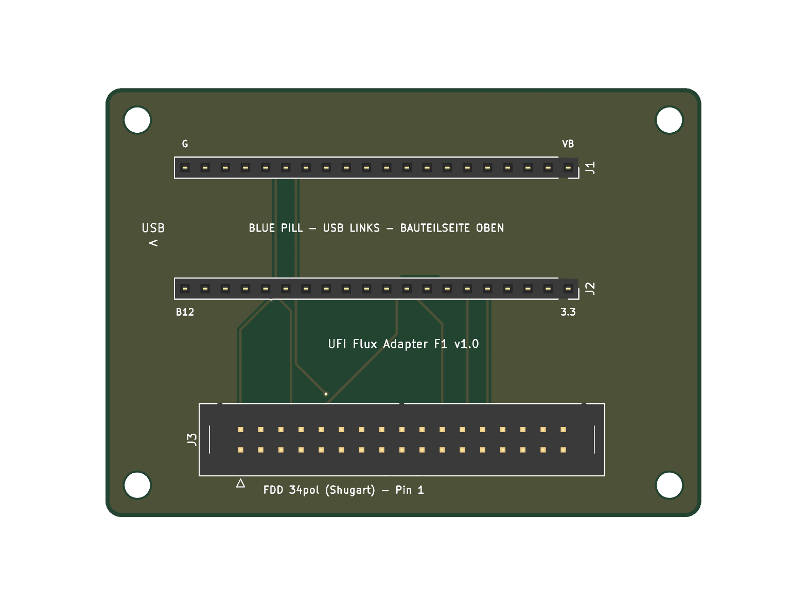

# UFI Flux Adapter F1 v1.0

Trägerplatine für ein **STM32F103C8 „Blue Pill“** mit 34-poligem Shugart-Floppy-Anschluss.
Läuft mit der offiziellen **Greaseweazle-F1-Firmware** (Submodell „F1 basic“) und den Greaseweazle-Host-Tools (`gw`).

## Eckdaten

| | |
|---|---|
| Platine | 75 × 54 mm, 2 Lagen, 1,6 mm FR4, GND-Fläche oben und unten |
| Designregeln | Leiterbahn 0,3 mm, Abstand 0,2 mm, Via 0,7/0,35 mm (JLCPCB-Standard reicht) |
| Prüfung | KiCad 10 DRC: 0 Verstöße, 0 unverbundene Pads |
| Bauteile | nur Durchsteck-Steckverbinder, kein SMD-Löten |

## Fertigung

`fertigung/UFI_FluxAdapter_F1_gerber.zip` direkt beim Leiterplattenhersteller hochladen (z. B. JLCPCB).
Standardoptionen genügen: 2 Lagen, 1,6 mm, HASL, beliebige Lötstoppfarbe.

## Stückliste

| Ref | Bauteil | Menge |
|---|---|---|
| J1, J2 | Buchsenleiste 1×20, RM 2,54 mm, gerade | 2 |
| J3 | Wannenstecker (IDC-Box-Header) 2×17, RM 2,54 mm, gerade | 1 |
| – | Blue Pill mit **originalem STM32F103C8T6** (Stiftleisten nach unten eingelötet) | 1 |
| H1–H4 | M3-Abstandsbolzen (optional) | 4 |
| – | 34-poliges Floppy-Flachbandkabel | 1 |

## Anschlussbelegung

Quelle: `greaseweazle-firmware`, `src/mcu/stm32f1/floppy.c` und `board.c`. Die Platine wurde gegen diese Liste automatisch geprüft (`scripts/verify_adapter.py`).

| Floppy-Pin | Signal | Blue Pill |
|---|---|---|
| 2 | DENSEL | PB9 |
| 8 | INDEX | PB6 |
| 10 | Drive Select 0 / Motor A | PB11 |
| 14 | Drive Select 1 | PB10 |
| 18 | DIR | PB12 |
| 20 | STEP | PB13 |
| 22 | WDATA | PB4 |
| 24 | WGATE | PB14 |
| 26 | TRK0 | PB7 |
| 28 | WRPROT | PB8 |
| 30 | RDATA | PB3 |
| 32 | SIDE | PB15 |
| alle ungeraden | GND | GND |
| 4, 6, 12, 16, 34 | – | nicht belegt |

PC14/PC15 bleiben offen, dadurch erkennt die Firmware das Submodell „F1 basic“. Alle genutzten Pins (PB3, PB4, PB6–PB15) sind beim STM32F103 5-V-tolerant, deshalb sind keine Pegelwandler nötig.

## Aufbau

1. Buchsenleisten J1/J2 und Wannenstecker J3 einlöten. Die Lage der Nase am Wannenstecker gibt der Bestückungsdruck vor.
2. Blue Pill einstecken: **Bauteilseite oben, USB-Buchse links**. Die Beschriftungen „VB“ und „3.3“ auf der Trägerplatine müssen neben den gleich beschrifteten Pins der Blue Pill liegen.
3. Floppy-Kabel an J3 anschließen, Pin 1 ist mit ▽ markiert.

## Inbetriebnahme

1. Greaseweazle-F1-Firmware auf die Blue Pill flashen, wie im Greaseweazle-Wiki beschrieben (F1-Firmware-Programmierung).
2. **Das Laufwerk braucht ein eigenes Netzteil** (5 V, bei 5,25"-Laufwerken zusätzlich 12 V). Die USB-Versorgung der Blue Pill reicht dafür nicht. Die Masse des Laufwerks läuft über das Flachbandkabel.
3. Test: `gw info`, danach z. B. `gw read --drive A test.scp` für ein PC-Laufwerk hinter dem Kabeldreh. Die Laufwerksangabe richtet sich nach Kabel und Bustyp, siehe Greaseweazle-Wiki.

Grenze von „F1 basic“: Am IBM-PC-Bus wird nur ein Laufwerk (Unit 0) unterstützt, weil die Pins 12 und 16 nicht belegt sind.

## Reproduzierbarkeit

Das Board wird vollständig von `scripts/build_adapter.py` erzeugt und mit Freerouting geroutet (`scripts/make_adapter.sh`). Das Skript erwartet Java 21 und `freerouting.jar` (v2.1.0) unter `scripts/tools/`; beides ist nicht im Repo enthalten.
`scripts/verify_adapter.py` liest die Netze aus dem fertigen Board zurück und vergleicht sie mit der Firmware-Belegung.
Einen Schaltplan gibt es nicht. Das Board enthält nur Steckverbinder, die Belegung oben ist die vollständige Netzliste.
