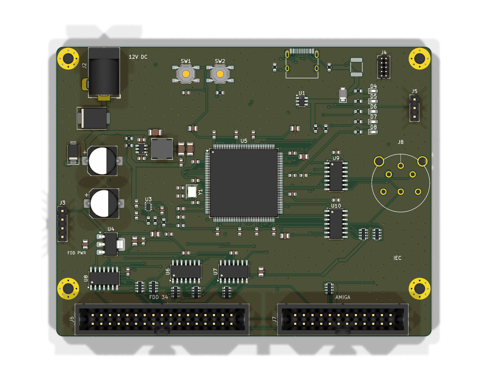

# UFI Headless – STM32H723 Flux Engine (ohne CM5)

Status: **Schaltplan + Layout v0.6** – ERC 0 Verstöße, alle Netze per Netlist-Export geprüft; PCB-DRC 0 Fehler, 0 Warnungen (Details unten).

| Sheet | Inhalt | Status |
|---|---|---|
| Power | USB-C (5V + Daten), 12V-Hohlstecker, TPS54202 Buck 12→5V, TPS2116 Power-Mux, AP7361C 3V3-LDO, FDD-Power-Ausgang über Polyfuses F2 (+5V, 1,1 A) / F3 (+12V, 1,1 A), Messpunkte TP1–TP4 (3V3, 5V, 12V, GND) | ✅ |
| MCU_Core | STM32H723ZGT6 (LQFP144), Entkopplung, VCAP, VDDA-Filter, HSE 25 MHz, Reset/Boot, SWD, Debug-UART, LEDs, **8 MB QSPI-PSRAM** APS6404L (U11) an OCTOSPI1 | ✅ |
| Flux_Interface | 2× SN74LS07 Open-Collector (40 mA) für 10 Ausgänge, 74LVC14A Schmitt-Inverter für 6 Eingänge, 1k Pull-ups auf 5V, Messpunkte TP5 (RDATA) / TP6 (INDEX) | ✅ |
| FDD_Connectors | 34-pol IBM-PC/Shugart, Amiga 2×12-Header (Pin n = DB23 Pin n), ESD-Arrays D9–D11 (ESDA6V1-5SC6) auf 15 Busleitungen | ✅ |
| IEC_Bus | SN74LS07 + 74LVC14A, 1k Pull-ups, 1×6-Stiftleiste J8 (Pin n = DIN-6 Pin n: 1 SRQ, 2 GND, 3 ATN, 4 CLK, 5 DATA, 6 RESET), DIN-6-Buchse extern per Kabel, ESD-Array D12 | ✅ |

v0.2 (gegenüber v0.1): PSRAM, ESD-Schutz an den externen Ports, Polyfuses in der Laufwerksversorgung, Messpunkte. Neue Teile haben feste Referenzen oberhalb der v0.1-Maxima (U11, C46, R16, F2/F3, D9–D12, TP1–TP6), alle bestehenden Referenzen sind unverändert.

v0.4: J6 Pin 6 = DRATE über den freien LS07-Kanal U7.11→U7.10 (PF11, Pull-up RN3.3) und Lötbrücke **JP1** (offen ab Werk), J6 Pin 3 über 3-fach-Lötbrücke **JP2** (ab Werk 1-2 = GND). JP1/JP2 sind Kupfer-Jumper, keine Bestückung; Funktion steht im Bestückungsdruck auf der Rückseite, vorne markiert „5V“ die +5V-Seite von JP2 (`scripts/add_silk_label.py`).

v0.5 (neue Teile mit festen Referenzen ab Q1, U12, R17, C47, D13, J9, SW3, TP7):

| Funktion | Teile | Bedienung / Firmware |
|---|---|---|
| Laufwerksversorgung schaltbar | Q1/Q3 AO3401A (High-Side), Q2/Q4 2N7002, 100k-Pull-downs | FDD_5V/FDD_12V aus, solange die MCU im Reset ist; Firmware schaltet 5 V, dann 12 V ein (`BOARD_STATUS` 0x1B) |
| Strommessung | R26/R29 0,1 Ω + U12/U13 INA180A1 (2 V/A) → PC0/PC1 | > 1,5 A für 50 ms → Schiene aus, ERR-LED |
| TVS an den Laufwerksausgängen | D13 SMF5.0CA (FDD_5V), D14 SMAJ15CA (FDD_12V) | – |
| WRITE LOCK | J11 (Jumper), U14 74LVC1G32, R33 | Jumper gesteckt = WGATE in Hardware gesperrt, Firmware meldet „write protected“ |
| Erweiterung | J9 2×5: 3V3, 5V, I²C1 (PB6/PB7, 2,2k), GPIO PE0/PE1, Taster-Leitungen | z. B. OLED-Display + Taster für Betrieb ohne PC |
| Taster | SW3/SW4 (PB8/PB9, aktiv low) | frei für Firmware-Funktionen |
| ~~microSD~~ | in v0.6 durch SD-NAND U15 ersetzt (s. u.) | – |
| Board-ID | R17/R18 an PA4 | 10k/10k = 1,65 V = v0.5, 10k/4,7k = 1,06 V = v0.6; steht in `GET_INFO` |
| Messpunkte | TP7 WDATA, TP8 WGATE (MCU-Seite) | – |

v0.6 (Gerät kommt in ein geschlossenes Gehäuse): microSD-Slot J10 entfällt, dafür **SD-NAND U15** fest eingelötet an denselben SDMMC2-Leitungen (Pull-ups R21–R25, C47/C48 bleiben).

| Funktion | Teile | Bedienung / Firmware |
|---|---|---|
| Speicher 4 GB | U15 CSNP32GCR01-AOW (C2841139), LGA-8 8×6,2 mm; derselbe Footprint passt für MKDV8GIL-AST (1 GB, C26159627, günstiger) | FAT32, beim ersten Start formatiert (Volume „UFI“) |
| Dump ohne PC | Taster A ≥ 1 s | ganze Diskette → `DUMPnnnn.SCP` (byte-gleich mit `ufi read-disk`); Taster B kurz = Abbruch |
| Betriebsart-Schalter (optional, extern) | Kippschalter EIN-AUS-EIN an **J9**: Mittelkontakt → Pin 1 (3V3), Seite 1 → Pin 5 (EXP_IO1/PE0), Seite 2 → Pin 6 (EXP_IO2/PE1) | Mitte = Flux (Host-Tool), Pin 5 = **USB-Floppy** (Diskette in Laufwerk A als USB-Laufwerk, PC-Formate 360K/720K/1.2M/1.44M, PID 0x4F56), Pin 6 = SD-Laufwerk. Nach jedem Wechsel blinkt ACT 1×/2×/3× = Flux/Floppy/SD |
| USB-Laufwerk | Taster B ≥ 2 s (nur Schalter in Mitte; oder `USB_MSC` 0x53) | Gerät meldet sich als Massenspeicher „UFI Flux Storage“ (PID 0x4F55), USB-LED an; Taster B ≥ 2 s zurück |
| Board-ID | R18 4,7k | 1,06 V = v0.6 |
| Front-LEDs (Gehäuse) | J12 2×4 + R34–R37 330 Ω (≈ 4 mA), je LED eine Reihe: 1+/2− PWR, 3+/4− ACT, 5+/6− FDD, 7+/8− ERR | parallel zu den Board-LEDs, keine Firmware-Änderung |

Projektbibliothek für U15: `lib/UFI_Headless.kicad_sym` und `lib/UFI_Headless.pretty` (in `sym-lib-table`/`fp-lib-table`); `kisch.py` und `add_parts.py` suchen dort zuerst.

A8 (Verpolschutz 12 V) war schon vorhanden: SS54 in Reihe + SMAJ15CA. A10 (50-pol 8"-Anschluss) passt nicht auf 110×85 mm – 8"-Laufwerke über externen Adapter.

Bestellung: [docs/Bestellung_JLC.md](docs/Bestellung_JLC.md) · Inbetriebnahme des Prototyps: [docs/Inbetriebnahme.md](docs/Inbetriebnahme.md).

## Signalpolarität (wichtig für Firmware)

- **Ausgänge** (FDD_*, IEC_*_OUT): MCU **low** = Busleitung aktiv (low). MCU high bzw. Reset/High-Z = losgelassen (TTL-Eingang des LS07 floatet high).
- **Eingänge** (FDD_INDEX/TRK0/WPROT/RDATA/DSKCHG/READY, IEC_*_IN): durch den 74LVC14A **invertiert** – MCU **high** = Busleitung aktiv (low). RDATA/INDEX-Capture daher auf **steigende** Flanke.

## 34-pol Stecker (J6)

Ungerade Pins GND (Pin 3 über JP2). 2 DENSITY · 6 DRATE (nur mit JP1) · 8 INDEX · 10 MOTOR_A · 12 DRVSEL_B · 14 DRVSEL_A · 16 MOTOR_B · 18 DIR · 20 STEP · 22 WDATA · 24 WGATE · 26 TRK0 · 28 WPROT · 30 RDATA · 32 SIDE · 34 DSKCHG/READY · 4 frei.

| Lötbrücke | Ab Werk | Umbau |
|---|---|---|
| JP1 (Pin 6) | offen – Pin 6 unbeschaltet | brücken für 3-Mode-Laufwerke (DRATE, Firmware `SET_LINES` 0x1A) |
| JP2 (Pin 3) | 1-2 gebrückt = GND | Leiterbahn 1-2 auftrennen, 2-3 brücken = +5V (FDD_5V, über F2) – **nur** für PS/2-Laufwerke mit Versorgung an Pin 3; ein normales Laufwerk hat dort GND → Kurzschluss (F2 löst aus) |
Shugart-Laufwerke: Pin 10/12/14 = DS0/DS1/DS2, Pin 16 = MOTOR ON – die Firmware wählt den Bustyp (wie Greaseweazle).

## Amiga-Header (J7) – gegen Amiga HRM verifiziert

Belegung nach Amiga Hardware Reference Manual, Header-Pin n = DB23-Pin n:
1 /RDY · 2 /DKRD · 3–7 GND · 8 /MTRXD · 9 /SEL2B · 10 /DRESB · 11 /CHNG · 12 +5V · 13 /SIDEB · 14 /WPRO · 15 /TK0 · 16 /DKWEB · 17 /DKWDB · 18 /STEPB · 19 /DIRB · 20 /SEL3B · 21 /SEL1B · 22 /INDEX · 23 +12V · 24 GND.
SEL1B teilt sich DRVSEL_B, MTRXD teilt sich MOTOR_B mit dem 34-pol Bus → nur ein Laufwerk gleichzeitig betreiben. SEL2B/SEL3B/DRESB per 1k auf +5V inaktiv.

Belegung bestätigt gegen Amiga Hardware Reference Manual, Appendix E „External Disk Interface Specification“ (alle 23 Pins). `docs/Amiga_DB23_Adapter_Cable.md` wurde entsprechend korrigiert (vorher GND auf DB23 12/15/20/23 und falsches Steckergeschlecht).

## Stromaufnahme +5V (Abschätzung)

3× LS07 ≈ 0,12 A · Pull-ups worst case ≈ 0,1 A · MCU über LDO ≈ 0,35 A · 3,5"-Laufwerk ≈ 0,5–1 A Spitze → ≈ 1,5 A. TPS2116 (2,5 A) und Buck (2 A) reichen; an USB-only über dem 500-mA-Default.

## Erzeugen / Prüfen

Die Schaltpläne werden per Skript generiert – **nicht** von Hand in Eeschema bearbeiten, solange das Design noch im Fluss ist (Änderungen gehen beim nächsten Lauf verloren).

```bash
PY="C:/Program Files/KiCad/10.0/bin/python.exe"
CLI="C:/Program Files/KiCad/10.0/bin/kicad-cli.exe"
cd kicad/UFI_Headless
"$PY" scripts/build_schematic.py                       # schreibt *.kicad_sch + netlist_summary.txt
"$CLI" sch erc --severity-all -o erc.rpt UFI_Headless.kicad_sch
"$CLI" sch export netlist -o headless.net UFI_Headless.kicad_sch
"$PY" scripts/verify_netlist.py headless.net           # Soll/Ist-Vergleich aller Netze
```

## Layout (v0.2, v0.1 automatisch erzeugt + inkrementelle ECO)



- 110 × 85 mm, 4 Lagen, 115 Bauteile (inkl. 6 Messpunkt-Pads), 4× M3
- DRC: **0 Fehler, 0 Warnungen, 0 unverbundene Elemente, Schaltplan-Parität ok**, kein Via-in-Pad. IDC-Konturen von J6/J7 ragen absichtlich über den Rand: per Regel `idc_edge_silk` in `UFI_Headless.kicad_dru` ausgenommen (Fertiger clippt), Bibliotheks-Footprints unverändert
- Fertigungsdaten in `fertigung/`: `UFI_Headless_gerber.zip` (Gerber + Excellon), `UFI_Headless-bom.csv`, `UFI_Headless-pos.csv` (KiCad) und `UFI_Headless-cpl-jlc.csv` (JLC-Spaltennamen + Gehäuse-Rotationsoffsets, `scripts/jlc_cpl.py`), `JLC_Rotation_Check.md` (Pin-1-Checkliste für den JLC-Viewer)

### Layout-Review (gemessen mit `scripts/layout_metrics.py`)

| Bereich | Ergebnis |
|---|---|
| Quarz Y1 | HSE_IN/HSE_OUT je 9,0 mm inkl. Lastkondensatoren, **keine Vias**, symmetrisch (vorgeroutet) |
| Buck TPS54202 | Eingangs-C 100 nF 1,8 mm an VIN, SW-Knoten 2,8 mm gerade zu L1 (0,6 mm), FB-Teiler direkt an Pin 4 (vorgeroutet) |
| Versorgung | Supply-Pours entlang der Routen (`power_pours.py`): +5V/+12V/VBUS ~0,85–1,8 mm effektiv, VBUS_F über In2 ~1,5 mm |
| MCU | 100 nF ~2,8 mm vor jedem VDD-Pin, alle VSS-Pins per Stich + Via direkt auf die GND-Lage |
| USB | D+/D− 43/44 mm (USB FS: Länge/Impedanz unkritisch), ESD U1 zwischen Buchse und MCU |

Handkorrekturen nach dem Autorouting (einmalig auf diesem Board, nicht Teil von `make_pcb.sh`): IEC_RESET-Sackgasse an RN8 ersetzt, PWR_SRC auf B.Cu nach y = 48 mm verlegt, GND-Vias an C33 (VDDA) und am Buck-GND (U2.1/C3.2); nach dem Tausch J8 DIN-6 → Stiftleiste (`scripts/swap_footprint.py` + inkrementelles Freerouting) IEC_SRQ U9↔U10 auf In2 bei x = 87,07 mm; CC2 an J1 links am VBUS-Via vorbei; v0.2-ECO: FD_DRVSEL_B unter D11 auf y = 74 mm verlegt (Platz für das GND-Via von D11.2), TP2/TP6 per `scripts/fix_connections.py` auf ihre Netz-Leiterbahnen gesetzt, Referenztexte per `scripts/place_refs.py`; v0.4-ECO: JP1/JP2 mit `ECO_SEARCH=4` in die Lücke U8/J6 gesetzt, die +5V-Verteilung (lief in v0.3 über U7.11) aus v0.3 übernommen bzw. per B.Cu-Brücke C40↔C41 ergänzt, zwei GND-Stitching-Vias für die Diagonale C43→RN6 entfernt, FD_DRATE U7.10→RN3.3 auf In2 von Hand verlegt; v0.5-ECO: Laufwerksversorgung rechts unten (x 85–106), J10 (microSD) mit Kartenöffnung zur Oberkante, R1 unter die USB-C-Buchse, TP8 misst WGATE hinter dem Sperr-Gatter (alte v0.4-WGATE-Kette dafür umgenetzt), +5V zu RN7/RN8 auf B.Cu, I_FDD5/SD_D1/SD_D3/+3V3/GND(J10.6) mit `scripts/eco/` von Hand bzw. per Labyrinth-Router (`maze_route.py`) verlegt, DRU-Regel für J9 Pin 1 (ein Thermal-Steg + Bahn). Ein neuer Pipeline-Lauf routet anders und kann andere Nacharbeit brauchen – **dieses Board ist der geprüfte Stand**.

### Vor einer Bestellung noch offen

1. **Bestelloptionen**: kein Via-in-Pad mehr (VBUS-Vias neben A4/A9, 0,5/0,25 mm) → „Via Covering: Tented“ reicht; kleine Vias 0,48/0,23 bzw. 0,5/0,25 mm – Aufpreis für < 0,3 mm Bohrung möglich. Alle Vias Restring ≥ 0,125 mm (DRC-Regel `min_via_annular_width`)
2. **Rotationen im JLC-Bestückungsviewer** gegen `fertigung/JLC_Rotation_Check.md` prüfen (22 gepolte Teile; Offsets nach kicad-jlcpcb-tools sind schon eingerechnet, SOT-583 U3, Y1, Dioden und J1 ohne Offset – dort besonders genau hinsehen)
3. **Handbestückung**: J2 (Hohlbuchse 5,5/2,1) und J7 (2×12 Wannenstecker) haben keine LCSC-Nummer
4. **IEC-Kabel**: J8 (1×6, 2,54 mm) auf DIN-6-Buchse, 1:1 nach Pinnummer (Lötseite der Buchse beachten)

## Layout-Pipeline (`scripts/make_pcb.sh`)

```bash
export TOOLS=<dir mit jdk-25*-jre + freerouting-2.4.1.jar>
bash scripts/make_pcb.sh eco U11:68:54 C46:77.5:57.5 ...   # Änderung am geprüften Board (Normalfall)
bash scripts/make_pcb.sh all                               # Neu-Layout von Null (place | route | all)
```

**Das geprüfte Board ist die Layout-Quelle.** Schaltplanänderungen kommen per `eco` hinein: `add_parts.py` setzt alle Pad-Netze aus der Netzliste neu, platziert neue Referenzen nahe dem angegebenen Punkt (frei von Courtyards, Löchern und gesperrten Leiterbahnen, möglichst wenige Bahnen im Weg), entfernt nur die Bahnen darunter; danach Pours entfernen, inkrementell routen (Schritte 2–6), Pours neu. Handkorrekturen bleiben dabei erhalten. `all` erzeugt ein neues Layout, das ein neues Review braucht. Netzklassen (Power/Supply) stehen in `.kicad_pro` und `build_pcb.py`.

1. `build_pcb.py` – Footprints aus der Schaltplan-Netlist (mit KIID-Pfaden → Schaltplan-Parität), Platzierung, 110×85 mm Outline, M3-Löcher, In1-GND-Plane, vorgeroutete USB-C-Auffächerung (gesperrt)
2. Freerouting 2.4.1 (Java 25) – F.Cu / In2.Cu / B.Cu als Signallagen, In1.Cu GND-Plane
3. `drop_violations.py` – Freerouting-Leiterbahnen mit DRC-Verstoß löschen und neu routen (bis sauber)
4. `widen_power.py` – Versorgungsnetze auf 0,8 mm (GND/3V3 0,5 mm) verbreitern, wo DRC es erlaubt
5. `finish_pcb.py` – GND-Pours F/B, +3V3-Pour In2, GND-Stitching-Vias, Inseln anbinden, Zonen füllen, Via-Bohrungen auf Restring ≥ 0,125 mm verkleinern
6. `power_pours.py` – Versorgungs-Pours entlang der Routen

Lagenaufbau: F.Cu Signal + GND-Pour · In1.Cu GND-Plane · In2.Cu Signal + 3V3-Pour · B.Cu Signal + GND-Pour.
Hinweis Fertigung: kein Via-in-Pad. VBUS-Vias sitzen neben den A4/A9-Pads (die NPTH-Stifte direkt darunter erzwingen den Versatz nach innen), CC2 läuft links am A9-Via vorbei. D−-Vias an J1 sind 0,48/0,23 mm.

## Stromversorgung

```
USB-C VBUS ──Polyfuse 1.5A──► VBUS_F ──────────────┐ VIN2 (Fallback)
12V Jack ──SS54──► +12V ──TPS54202──► +5V_DRV ─────┤ VIN1 (Priorität, Schwelle ≈4.3V)
                     │                             TPS2116 ──► +5V ──► AP7361C ──► +3V3
                     └─F3 1.1A─► FDD_12V           (2.5A)      └─F2 1.1A─► FDD_5V
                                 (J3 Pin 4, J7 Pin 23)                     (J3 Pin 1, J7 Pin 12)
```

Ein Kurzschluss im Laufwerkskabel löst nur F2/F3 aus; +5V/+3V3 der Logik bleiben stehen.

- Nur USB: Logik + 3,5"-Laufwerk aus USB-C. Ohne CC-Auswertung ist offiziell nur der USB-Default-Strom (500 mA) zugesichert; 3,5"-Laufwerke laufen damit in der Praxis meist (wie bei Greaseweazle), für Spec-Konformität später CC-Spannung per ADC auswerten.
- 12V gesteckt: Laufwerks-5V aus dem Buck, 12V für 5,25"-Laufwerke.
- `PWR_SRC` (TPS2116 ST, open-drain, Pull-up auf 3V3) → PG4, Firmware kann die aktive Quelle lesen.

## GPIO-Belegung (Referenz für Firmware)

| Signal | Pin | Funktion |
|---|---|---|
| FDD_RDATA | PA5 | TIM2_CH1 (AF1) Input Capture, 32 bit |
| FDD_INDEX | PA1 | TIM2_CH2 (AF1) Input Capture, gleiche Zeitbasis wie RDATA |
| FDD_WDATA | PA6 | TIM3_CH1 (AF2) Output |
| FDD_MOTOR_A / _B | PE7 / PE8 | GPIO out |
| FDD_DRVSEL_A / _B | PE9 / PE10 | GPIO out |
| FDD_STEP / DIR / SIDE | PE11 / PE12 / PE13 | GPIO out |
| FDD_WGATE / DENSITY | PE14 / PE15 | GPIO out |
| FDD_DRATE | PF11 | GPIO out → U7.11, J6 Pin 6 nur über JP1 (v0.4) |
| FDD5_EN / FDD12_EN | PE2 / PE3 | GPIO out, high = Laufwerksversorgung an (v0.5) |
| I_FDD5 / I_FDD12 | PC0 / PC1 | ADC1 INP10/INP11, INA180A1 2 V/A (v0.5) |
| WLOCK | PE4 | GPIO in, high = WRITE-LOCK-Jumper gesteckt (v0.5) |
| BOARD_ID | PA4 | ADC1 INP18, Teiler = Board-Revision (v0.5) |
| I2C_SCL / I2C_SDA | PB6 / PB7 | I2C1 (AF4) auf J9 (v0.5) |
| EXP_IO1 / EXP_IO2 | PE0 / PE1 | GPIO auf J9 (v0.5) |
| BTN_A / BTN_B | PB8 / PB9 | GPIO in, Pull-up, low = gedrückt (SW3/SW4, J9) (v0.5) |
| SD CK / CMD / D0–D3 | PD6 / PD7 / PG9–PG12 | SDMMC2 (AF11, D2/D3 AF10) (v0.5) |
| (frei) | PG13 | v0.5 Card-Detect, ab v0.6 unbenutzt |
| FDD_TRK0 / WPROT / DSKCHG / READY | PF0 / PF1 / PF2 / PF3 | GPIO in |
| IEC_{ATN,CLK,DATA,SRQ,RESET}_OUT | PD0–PD4 | GPIO out → OC-Treiber |
| IEC_{ATN,CLK,DATA,SRQ,RESET}_IN | PF4–PF8 | GPIO in |
| USB D− / D+ | PA11 / PA12 | OTG_HS mit internem FS-PHY |
| VBUS_SENSE | PA9 | Teiler 22k/33k (5V → 3,0V) |
| CC1 / CC2 | PA0 / PA3 | ADC1 INP16/INP15: Spannung an Rd 5,1k → USB-C-Quellenstrom 0,5/1,5/3 A (`ufi usb-power`), v0.3 |
| (Atari SIO, optional) | PD1 / PF6 / PD0 | UART4_TX → DATA OUT (über IEC_CLK_OUT), UART7_RX ← DATA IN (IEC_DATA_IN, RXINV wegen LVC14), COMMAND = IEC_ATN_OUT – nur Firmware + DIN-6→SIO-13-Kabel, keine Platinenänderung |
| SWDIO / SWCLK / SWO | PA13 / PA14 / PB3 | Debug |
| DBG_TX / DBG_RX | PD8 / PD9 | USART3 (AF7) |
| LED_ACT / FDD / USB / ERR | PG0–PG3 | High = an |
| PWR_SRC | PG4 | TPS2116 Status |
| HSE | PH0 / PH1 | 25 MHz |

### Firmware (`firmware/`) – an dieses Board angepasst

- Pintabelle + Polarität zentral in `firmware/include/board.h` / `src/board_headless.c`; alle Module nutzen `bus_out()` / `bus_in()` (logisch: true = Busleitung aktiv)
- Flux lesen: RDATA TIM2_CH1 (PA5) + INDEX TIM2_CH2 (PA1), steigende Flanke, gleiche 32-bit-Zeitbasis; DMA (Double-Buffer, 128-KB-Blöcke) schreibt linear in den Flux-Speicher, Umdrehungen sind Ausschnitte (Grenzen exakt per Zeitstempel)
- Flux-Speicher: 8 MB QSPI-PSRAM U11 (`ufi_psram.c`, OCTOSPI1 memory-mapped bei 0x90000000, 68,75 MHz, bis 20 Umdrehungen); antwortet das PSRAM nicht (ID-/Mustertest), Rückfall auf 224 KB AXI-SRAM
- Flux schreiben: WDATA = TIM3_CH1 (PA6), abwärtszählende PWM, ARR per DMA je Flux-Intervall, gleicher 275-MHz-Takt wie beim Lesen, Präkompensation, Schreibschutz-Prüfung
- IEC getrennt OUT (PD0–4) / IN (PF4–8), Protokoll mit Timeouts, EOI und Turnaround nach Butterfield; Amiga J7: Motor per Select-Latch (MTRXD = MOTOR_B, SEL1B = DRV_SEL_B); Apple-Code hinter `BOARD_HAS_APPLE` (hier 0)
- Build: `cmake -S firmware -B firmware/build -G Ninja -DSTM32CUBE_PATH=<STM32Cube_FW_H7_V1.11.0>` + `cmake --build firmware/build` → 0 Fehler, 0 Warnungen (Compiler + Linker, 41 KB Flash). **Auf Hardware ungetestet.**

## Sourcing-Notizen

- LCSC-Nummern: per JLCPCB-API (05.10.2026, Lagerbestand geprüft) zugeordnet, Tabelle `LCSC` in `scripts/build_schematic.py`. Extended-Teile kosten bei JLC je ~3 $ Rüstgebühr; Spule SRN6045TA-150M (C1330797) hatte nur 189 Stück Lager
- Quarz: YXC X322525MOB4SI (C9006, Basic), 25 MHz, CL 12 pF → Lastkondensatoren 2× 18 pF C0G (C1647); gm_crit ≈ 0,97 mA/V < 1,5 mA/V (H723 HSE)
- IEC: Stiftleiste 1×6 (C37208) statt DIN-6 auf der Platine; DIN-6-Buchse sitzt extern (Gehäuse)
